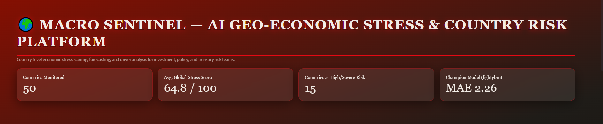
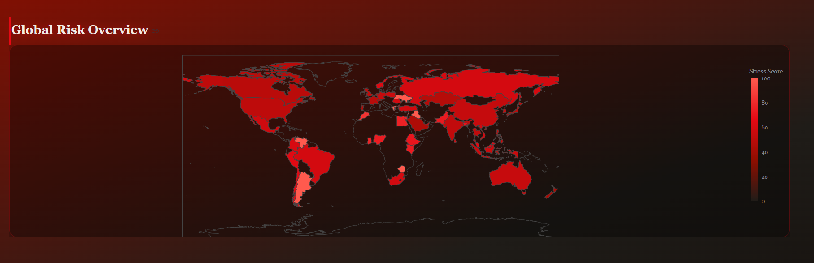
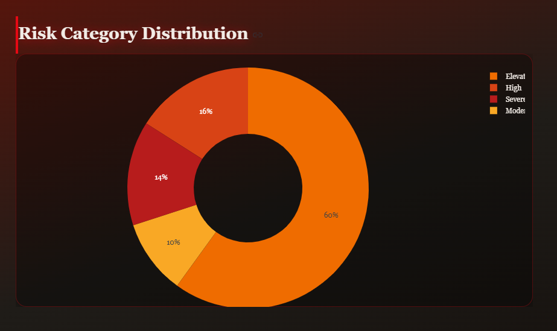
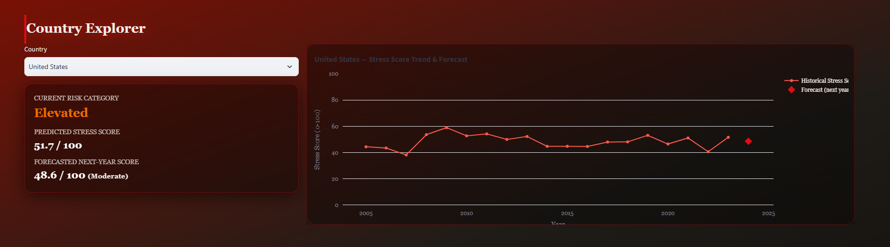
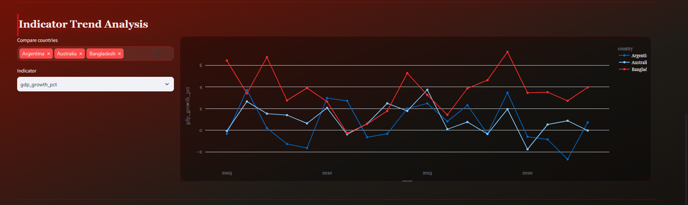
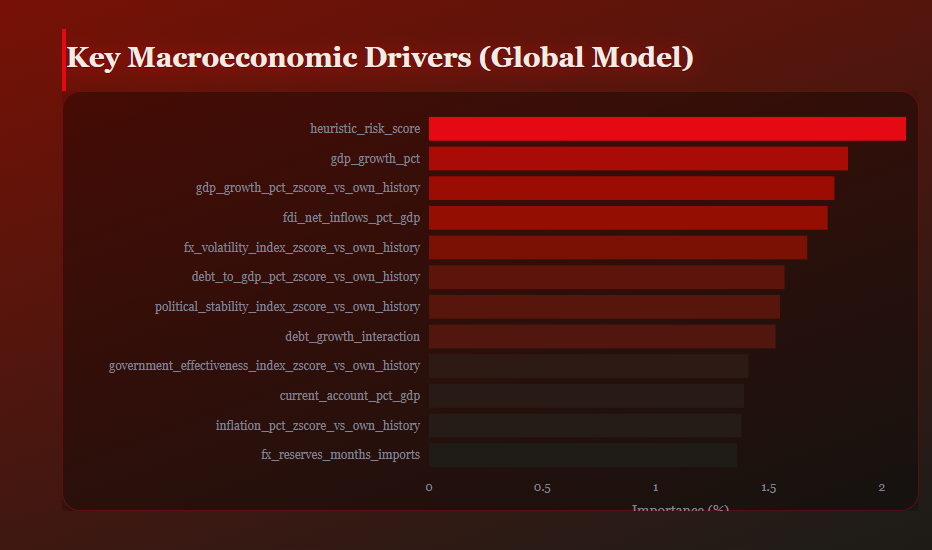

# 🌍 Macro Sentinel — AI Geo-Economic Stress & Country Risk Platform

Macro Sentinel is an end-to-end machine learning platform that predicts **geo-economic stress scores** for countries and translates them into interpretable **risk categories**. It covers the full pipeline — data ingestion, preprocessing, feature engineering, model training/tracking with MLflow, evaluation, and an interactive Streamlit dashboard styled with a cinematic dark gradient theme.

## Dashboard Preview



*Country-level stress scoring, trend forecasting, and risk driver analysis — presented in a Netflix-inspired dark UI (crimson-to-black gradient, glowing serif headlines, glass-panel metric cards).*

<table>
  <tr>
    <td width="50%">
      
      <p align="center"><sub><b>Global Risk Overview</b> — world map of country-level stress scores</sub></p>
    </td>
    <td width="50%">
      
      <p align="center"><sub><b>Risk Category Distribution</b> — share of countries by risk tier</sub></p>
    </td>
  </tr>
  <tr>
    <td width="50%">
      
      <p align="center"><sub><b>Country Explorer</b> — per-country stress score trend & forecast</sub></p>
    </td>
    <td width="50%">
      
      <p align="center"><sub><b>Indicator Trend Analysis</b> — multi-country indicator comparison</sub></p>
    </td>
  </tr>
  <tr>
    <td colspan="2">
      
      <p align="center"><sub><b>Key Macroeconomic Drivers</b> — global feature importance behind the model's predictions</sub></p>
    </td>
  </tr>
</table>

## Features

- **End-to-end pipeline** — ingestion → preprocessing → feature engineering → training → evaluation → prediction, runnable stage-by-stage or all at once via `main.py`
- **Multiple models compared** — Linear Regression, Random Forest, XGBoost, and LightGBM, with the best-performing "champion" model selected automatically
- **Experiment tracking** — all runs, metrics, and model artifacts logged and versioned with MLflow
- **Cinematic Streamlit dashboard** — dark crimson-to-black gradient background, Georgia serif display headings with subtle glow, and glass-style metric/plot cards for browsing country-level stress scores, risk categories, and top feature drivers
- **Config-driven** — pipeline behavior controlled through `config/config.yaml`, no hardcoded paths or parameters
- **Tested** — unit tests for ingestion, feature engineering, validation, and training under `tests/`

## Project Structure

```
macro-sentinel/
├── config/              # Pipeline configuration (config.yaml)
├── dashboard/           # Streamlit app (app.py)
├── data/                # raw / interim / processed data (gitignored)
├── models/              # Trained model artifacts (gitignored)
├── mlruns/               # MLflow experiment tracking store (gitignored)
├── notebooks/           # EDA and exploration scripts
├── reports/             # Architecture docs, EDA summary, figures, metrics
├── scripts/             # Utility scripts (e.g. synthetic data generation)
├── src/                 # Core package: ingestion, preprocessing, features,
│                         #   training, evaluation, prediction, validation, utils
├── tests/               # Pytest test suite
├── main.py              # Single entrypoint for the ML pipeline
├── setup.py             # Package metadata
└── requirements.txt      # Python dependencies
```

## Getting Started

### 1. Clone and set up the environment

```bash
git clone https://github.com/Shubham03-hub/Macro-Sentinel-AI-Geo-Economic-Stress-Country-Risk-Platform.git
cd Macro-Sentinel-AI-Geo-Economic-Stress-Country-Risk-Platform

python -m venv .venv
source .venv/bin/activate      # Windows: .venv\Scripts\Activate.ps1

pip install --upgrade pip
pip install -r requirements.txt
```

### 2. Run the ML pipeline

```bash
# Run the full pipeline (preprocess → features → train → evaluate → predict)
python main.py --stage all

# Or run a single stage
python main.py --stage preprocess
python main.py --stage features
python main.py --stage train
python main.py --stage evaluate
python main.py --stage predict
```

### 3. Launch the dashboard

```bash
streamlit run dashboard/app.py
```

The app opens at `http://localhost:8501`, with the Netflix-style crimson-to-black gradient theme and glowing serif headlines applied automatically.

### 4. (Optional) View MLflow experiment tracking

```bash
mlflow ui --backend-store-uri mlruns
```

## Docker

The project also ships with a `Dockerfile` and `docker-compose.yml` for containerized deployment:

```bash
docker compose up --build
```

## Tech Stack

Python · pandas · scikit-learn · XGBoost · LightGBM · MLflow · Streamlit · Plotly

## License

This project is licensed under the [MIT License](LICENSE).